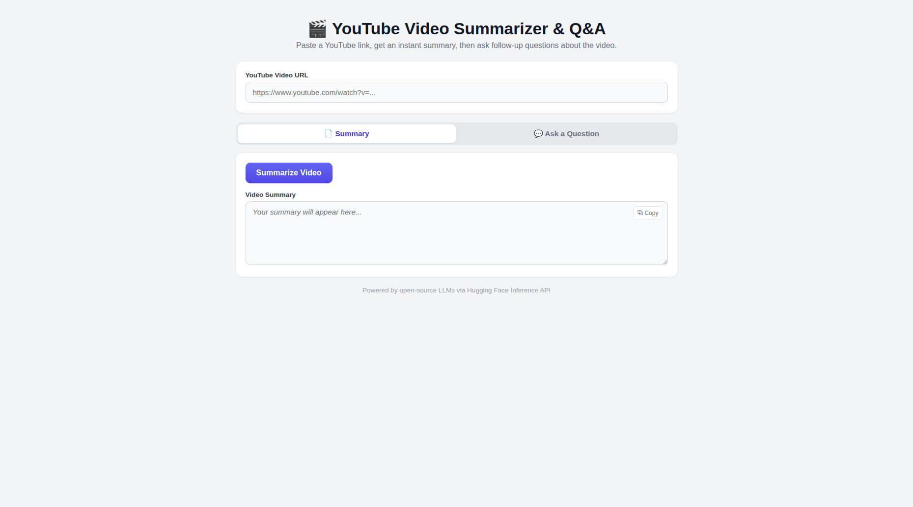

# AI-Powered-Advanced-RAG
 
An AI-powered YouTube Summarizer and Q&A tool that turns any video transcript into a searchable knowledge base. The application fetches the video transcript, summarizes it, and answers user questions using Retrieval-Augmented Generation (RAG) with open-source AI models.
 
---
 
## Features
- Fetch transcript directly from a YouTube video URL
- AI-generated video summary
- Ask natural-language questions about the video content
- Semantic search over transcript chunks using FAISS
- Retrieval-Augmented Generation (RAG) for accurate, context-grounded answers
- Runs on open-source, freely hosted AI models
---
 
## Working Flow
```
YouTube URL
      │
      ▼
Transcript Extraction (YouTube Transcript API)
      │
      ▼
Text Chunking (LangChain Text Splitter)
      │
      ▼
Embedding Generation (Sentence-Transformers)
      │
      ▼
Vector Store (FAISS)
      │
      ▼
Retrieval (Top-k Relevant Chunks)
      │
      ▼
LangChain RAG Pipeline
      │
      ▼
Open-Source LLM (Hugging Face Inference API)
      │
      ▼
Summary + Contextual Answers
```
 
---
 
## Concepts
- **Retrieval-Augmented Generation (RAG):** Retrieves the most relevant transcript chunks before generating an answer, keeping responses grounded in the actual video content.
- **Embeddings:** Converts transcript chunks into numerical vectors that capture semantic meaning.
- **Vector Store (FAISS):** Enables fast similarity search to find the transcript segments most relevant to a question.
- **Large Language Model (LLM):** Understands retrieved context and generates natural-language summaries and answers.
- **LangChain:** Framework for chaining together retrieval, prompting, and generation steps.
---
 
## Technology Stack
- Python
- Gradio
- LangChain
- FAISS
- Sentence-Transformers
- Hugging Face Inference API
- YouTube Transcript API
---
 
## Demo

